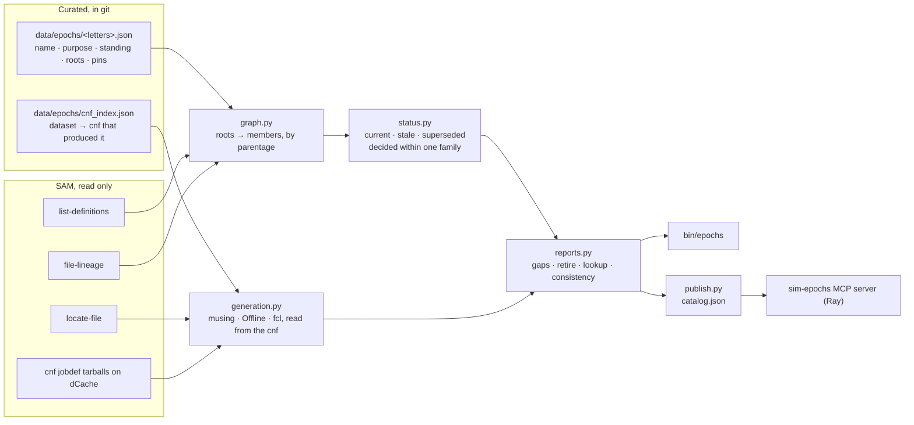
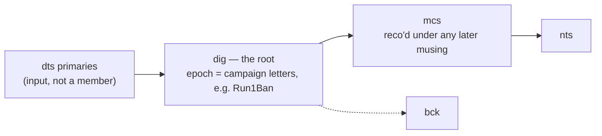
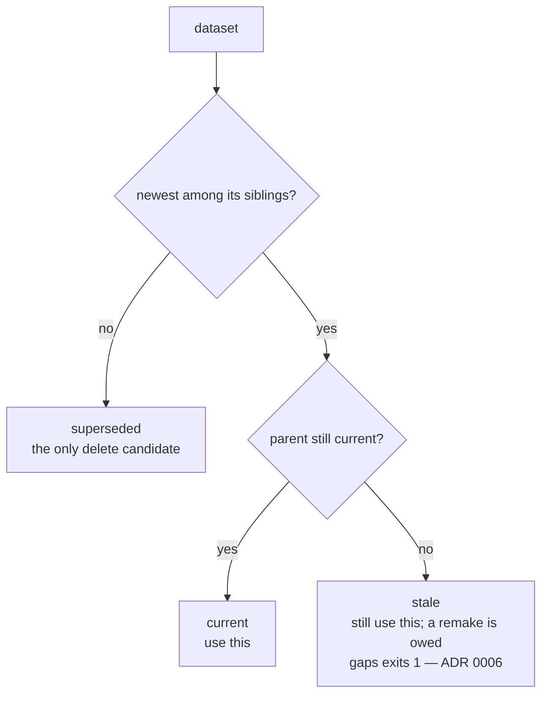

# sim-epochs

Mu2e has hundreds of simulation datasets. Nobody can say from the names
alone which ones to use, which ones are old copies, and which ones can
be deleted. Three hand-written lists try to say it, and they disagree.

Epochs answers those three questions automatically, from the file
catalog, every time it runs. The only thing a person writes is one tiny
file per digitization campaign: its name, what it was for, and whether
it is still in use. Nothing derived is ever stored, so nothing goes
stale.

Design: `docs/design.md`. Glossary: `CONTEXT.md`. Decisions:
`docs/adr/`. Cut from `Mu2e/prodtools` on 2026-09-05 with its history.

## The three questions

All examples below are real output from production SAM, 2026-09-05.
Set up once: `source /cvmfs/mu2e.opensciencegrid.org/setupmu2e-art.sh
&& muse setup ops`. `--family` keeps each run to about 40 seconds.

### 1. Which one do I use?

For every kind of dataset the tool finds all the versions, picks the
newest name, and checks that the thing it was made from is also the
newest. `current`: use it. `stale`: still use it, a remake is owed.
`superseded`: a newer version exists, do not use it.

```
$ bin/epochs members --family Run1B --status current
current    dig  Run1Ban        19 dig.mu2e.CeEndpoint.Run1Ban_best_v1_4-000.art  [hold: epoch Run1Ban is frozen]
current    dig  Run1Ban      1999 dig.mu2e.CeEndpointMix1BB.Run1Ban_best_v1_4-000.art  [hold: epoch Run1Ban is frozen]
current    dig  Run1Baf      1999 dig.mu2e.CeEndpointMixLow.Run1Baf_best_v1_4-000.art  [hold: epoch Run1Baf is frozen]
...
current    mcs  Run1Ban        19 mcs.mu2e.CeEndpoint-KL.Run1Baw_best_v1_5.art  [hold: epoch Run1Ban is frozen]
...
current    nts  Run1Ban        19 nts.mu2e.CeEndpoint-KL.Run1Baw_best_v1_5.root  [hold: epoch Run1Ban is frozen]
```

87 rows: 31 dig, 29 mcs, 27 nts. Columns are status, tier, epoch,
number of files, dataset. `--status superseded` lists what has been
replaced (53 in Run1B). `--status stale` is where this differs from
picking the newest name:

```
$ bin/epochs members --family Run1B --status stale
stale      mcs  Run1Bah        10 mcs.mu2e.MuCap1809keVCalo-KL.Run1Bah_best_v1_4-001.art
stale      mcs  Run1Bav      1998 mcs.mu2e.NoPrimaryMix1BB-KL.Run1Baw_best_v1_5-002.art
stale      nts  Run1Bah        10 nts.mu2e.MuCap1809keVCalo-KL.Run1B-005.root
stale      nts  Run1Bav      1998 nts.mu2e.NoPrimaryMix1BB-KL.Run1Baw_best_v1_5-002.root
```

Each is the newest name of its kind, so a name-only tool calls it
latest. The MuCap1809keVCalo dig was remade under MDC2025aw and never
re-reconstructed, so the Run1Bah reco is the one to use today and a
remake is owed. The NoPrimaryMix1BB reco was made from the 20000-file
dig `-001`, which a 2000-file dig `-003` has since superseded by name.
Note the ntuple `Run1B-005`: its name carries no campaign at all; only
parentage places it in epoch Run1Bah. For one dataset:

```
$ bin/epochs lookup --family Run1B dig.mu2e.CeEndpoint.Run1Ban_best_v1_4-000.art
{
 "kind": "member", "epoch": "Run1Ban", "tier": "dig", "status": "current",
 "hold": "epoch Run1Ban is frozen", "nfiles": 19,
 "parents": ["dts.mu2e.CeEndpoint.Run1Bab.art"],
 "children": ["mcs.mu2e.CeEndpoint-KL.Run1Baw_best_v1_5.art", ...],
 "superseded_by": "",
 "generation": {...}, "generation_reason": null
}
```

### 2. What made it?

The name is a claim; the job configuration is the fact. The tool opens
the cnf tarball that produced each dataset and reads the Musing, the
Offline version, the geometry, the conditions and the fcl. Names cannot
tell you this: a dsconf names a campaign, not a geometry file or a
DbService version; ntuple dsconfs (`MDC2025-003`) name no era at all;
and the convention is not enforced, as the first example shows.

```
$ bin/epochs lookup --family Run1B mcs.mu2e.CeEndpoint-KL.Run1Baw_best_v1_5.art
  "generation": {
    "label": "SimJob/Run1Baq",
    "setup": "/cvmfs/mu2e.opensciencegrid.org/Musings/SimJob/Run1Baq/setup.sh",
    "geometry": "Offline/Mu2eG4/geom/geom_run1_b_v40.txt",
    "dbservice": "v1_5",
    "cnf": "cnf.mu2e.CeEndpoint-reco.Run1Baw_best_v1_5.0.tar",
    "source": "index"
  }
```

Named `Run1Baw`, built with `Run1Baq`.

Does the name fix the rest? Measured over every readable Run1B and
MDC2025 cnf in the index (796 of 946):

- **Offline version**: fixed by the Musing the name points at.
- **Field map**: never overridden in any cnf. Musing default.
- **Conditions**: the `_best_v1_5` tail is the DbService purpose and
  version, and where both name and fcl set it they agree 336 times
  out of 343. The 7 that disagree are all named `v1_3` and built
  against `v1_1` (five MDC2025af cnfs, one MDC2025ar). The cnf read is
  what finds them.
- **Geometry**: fixed per campaign, and the name identifies the
  campaign. Every current dig of an epoch sits on one geometry file
  (Run1Baf `v01`, Run1Bah `v03`, Run1Ban through Run1Baw `v40`). It
  varies only under one *Musing*: `SimJob/Run1Bai` was used for three
  pileup iterations, `-001` on `v04`, `-002` on `v05`, `-003` on `v06`,
  the first two now superseded; `SimJob/MDC2025av` served both the
  MDC2025av primaries (`geom_run1_a`) and the Run1Bav digs (`v40`).
  The dsconf tells them apart, the Musing does not.

So the name fixes what made a dataset, through the campaign it names.
The cnf is the record that lets the tool check the claim, and it adds
the exact fcl. Everything the tool found wrong so far — the 13 recos
named `Run1Baw` on `Run1Baq`, the 7 datasets named `v1_3` on `v1_1` —
came from that check.

Across a whole family, per tier:

```
$ bin/epochs consistency --family Run1B
Run1B    dig     1  SimJob/MDC2025av                  NoPrimaryMix1BB
Run1B    dig     8  SimJob/Run1Baf                    CeEndpointMixLow, DIOtail0_60MixLow, ...
Run1B    dig     8  SimJob/Run1Bah                    DIOtail0_60, DIOtail0_60Mix1BB, ...
Run1B    dig     8  SimJob/Run1Ban                    CeEndpoint, CeEndpointMix1BB, CosmicCRYAll, ...
Run1B    mcs     8  SimJob/Run1Baf                    CeEndpointMixLow-KL, DIOtail0_60MixLow-KL, ...
Run1B    mcs     8  SimJob/Run1Bah                    DIOtail0_60-KL, DIOtail0_60Mix1BB-KL, ...
Run1B    mcs    13  SimJob/Run1Baq                    CeEndpoint-KL, CeEndpointMix1BB-KL, CosmicCRYAll-KL, ...
Run1B    nts     7  AnalysisMDC2025/v01_01_04         CeEndpointMixLow-KL, DIOtail0_60MixLow-KL, ...
Run1B    nts     7  AnalysisMDC2025/v01_02_00         DIOtail0_60-KL, DIOtail0_60Mix1BB-KL, ...
Run1B    nts    13  AnalysisMDC2025/v02_01_00         CeEndpoint-KL, CeEndpointMix1BB-KL, ...
```

Columns: family, tier, how many current datasets, the generation that
made them, their descs (trimmed here; the tool prints all). Read it
two ways. An analyst combining CeEndpoint-KL with DIOtail-KL is mixing
Run1Baq reco with Run1Bah reco and two EventNtuple schemas. A producer
planning a round reads the rows not on the newest generation as the
re-reco list: here the eight MixLow and the eight DIOtail descs.

### 3. What can be deleted together?

A dig campaign plus everything made from it is one epoch. When all of
it is replaced, the whole epoch goes at once. Two checks come first.

Is the round complete? A remade parent obligates remaking every
downstream tier (ADR 0006). `gaps` exits 1 while anything is owed:

```
$ bin/epochs gaps --family MDC2025; echo rc=$?
missing  MDC2025ai  nts  PBINormal_33344Mix1BB                    dig.mu2e.PBINormal_33344Mix1BB.MDC2025ai_best_v1_2.art has no current nts
missing  MDC2025au  mcs  ensembleMDS3bOnSpill                     dig.mu2e.ensembleMDS3bOnSpill.MDC2025au_best_v1_5.art has no current mcs
...
rc=0
```

Twelve `missing` rows (work not yet done) and no `stale` row, so the
rule holds and the exit code is 0.

Is the newest name thin? When the newest version has far fewer files
than the one it replaces, the tool says so on stderr rather than
guessing which one you meant:

```
count warning: dig.mu2e.NoPrimaryMix1BB.Run1Bav_best_v1_5-003.art 2000 files vs dig.mu2e.NoPrimaryMix1BB.Run1Bav_best_v1_5-001.art 20000
```

Then the delete list, in the format the data manager's purge tool
reads. It always builds every family, and it refuses to print anything
while the catalog is incomplete:

```
$ bin/epochs retire --family Run1B
```

Empty today: every Run1B epoch is `frozen`, a hold on every member, so
nothing in Run1B is proposed. A row, when there is one, looks like
`DELETE - - YES 20000 dig.mu2e.X.Run1Bah_best_v1_4.art NONE # superseded by dig.mu2e.X.Run1Ban_best_v1_4-000.art`.

## How it fits together



An epoch is one digitization campaign. Its roots are `dig` patterns;
everything downstream of a root by parentage is a member. Re-reco or
re-ntuple never starts a new epoch; re-digitizing does.



## The status rule

Status is a property of one dataset, computed against its siblings —
same family, tier and description, different dsconf. It answers one
question: should new work use this dataset.



Families (`MDC2025`, `Run1B`, `MDC2020`) never compete with each other.
A **hold** is separate from status: a held dataset can be superseded
for new work and still undeletable.

**The rule (ADR 0006):** the newest-named dataset per description is
the one to run on, and production keeps that promise — a remade parent
obligates remaking every downstream tier before the round is complete.
`bin/epochs gaps` is the round-complete check.

## Running

Any Mu2e node. The only runtime dependency outside the standard library
is `samweb_client`, which is not on PyPI:

```bash
source /cvmfs/mu2e.opensciencegrid.org/setupmu2e-art.sh
muse setup ops
bin/epochs members --family Run1B --status current
```

No Musing, no `muse setup SimJob`, no production account.

## Verbs

| verb | answers |
|---|---|
| `members [--tier T] [--status S]` | which datasets exist and which one to use; tier-major, `status tier epoch nfiles dataset` |
| `gaps` | a dig content with no mcs or nts yet, and every stale member; **exits 1** on a stale member of a current epoch |
| `consistency` | generation spread per tier: which musing and Offline version made the current datasets |
| `lookup DATASET` | one dataset's epoch, status, generation, children, `superseded_by` |
| `retire` | delete candidates in `purge_proposal` line format; refuses while the catalog is incomplete |
| `propose --family F` | write `data/epochs/<letters>.json` for every dig campaign that has none |
| `index-cnfs` | rebuild `data/epochs/cnf_index.json` |
| `publish --out FILE` | the catalog document the sim-epochs MCP server reads |

`--family F` restricts the build for `members`, `gaps`, `lookup` and
`consistency` (seconds instead of minutes); `retire` and `publish`
always build every family. `--epoch` filters printed rows for
`members`, `gaps` and `retire`, and is refused elsewhere. `--json` on
any listing verb. `--quiet` drops the stderr progress.

Generation is read out of the cnf jobdef tarball, so it is evaluated
for MDC2025 and Run1B only: MDC2020-era cnfs are per-job `.fcl` files,
and those rows read `not evaluated`.

## Epoch files

One per digitization campaign:

```json
{
  "name": "Run1Ban",
  "purpose": "SimJob/Run1Ban, Offline v13_17_10",
  "status": "frozen"
}
```

`status` is the epoch's standing: `current` (being worked on),
`frozen` (a hold on every member, nothing expected to change),
`retired` (every member a delete candidate). `roots` is optional: absent means the three dig patterns
derived from the name — `dig.mu2e.%.Run1Ban.art`,
`dig.mu2e.%.Run1Ban_%.art`, `dig.mu2e.%.Run1Ban-%.art` — which claim
the bare, versioned and collision-suffixed dsconfs without swallowing
the next revision (`Run1Ban2`). Write `roots` only when that default is
wrong. `pins` (`exclude`, `hold`, `not_expected`, `order`, `notes`) is
likewise optional and hand-written, each entry with a reason.

## Layout

| module | lines | does |
|---|---:|---|
| `sim_epochs/cli.py` | 456 | the verbs, scoping, exit codes |
| `sim_epochs/graph.py` | 333 | members of every epoch, from SAM parentage |
| `sim_epochs/generation.py` | 260 | what code made a dataset, from the cnf |
| `sim_epochs/reports.py` | 253 | gaps, retire list, lookup, consistency |
| `sim_epochs/status.py` | 201 | current / stale / superseded |
| `sim_epochs/source.py` | 172 | the only module that talks to SAM |
| `sim_epochs/epoch_files.py` | 152 | load, validate, propose epoch files |
| `sim_epochs/mu2e.py` | 126 | the Mu2e conventions: name grammar, cnf tarball, SAM calls, paths |
| `sim_epochs/progress.py` | 109 | stderr progress for a multi-minute build |
| `sim_epochs/publish.py` | 88 | the catalog document |
| `sim_epochs/dsconf.py` | 83 | dsconf grammar and clock-free ordering |

2237 lines of code, 2177 of tests (165, no SAM, no Mu2e environment),
27 epoch files, a 257 KB cnf index.

## Tests

```bash
python3 -m unittest discover -s tests
```

`samweb_client` is stubbed; CI runs the suite on Python 3.9, 3.10 and 3.12.
