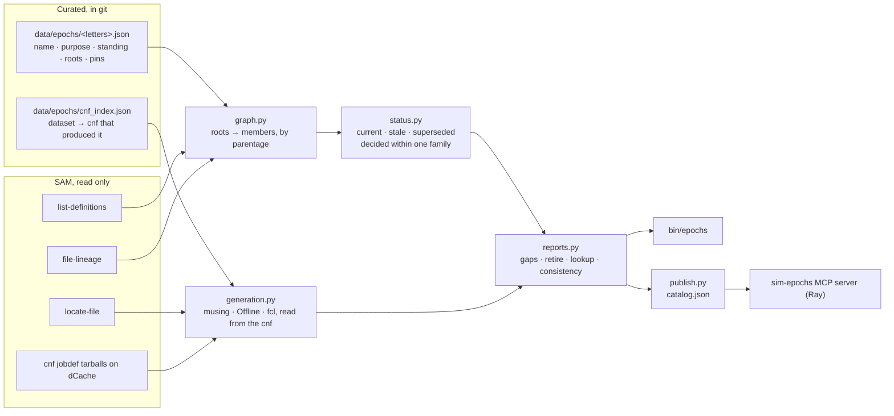
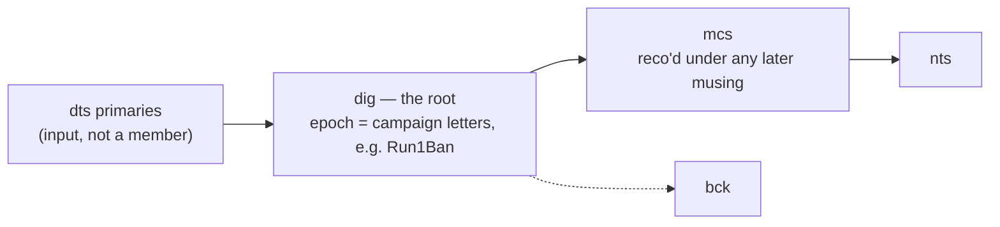
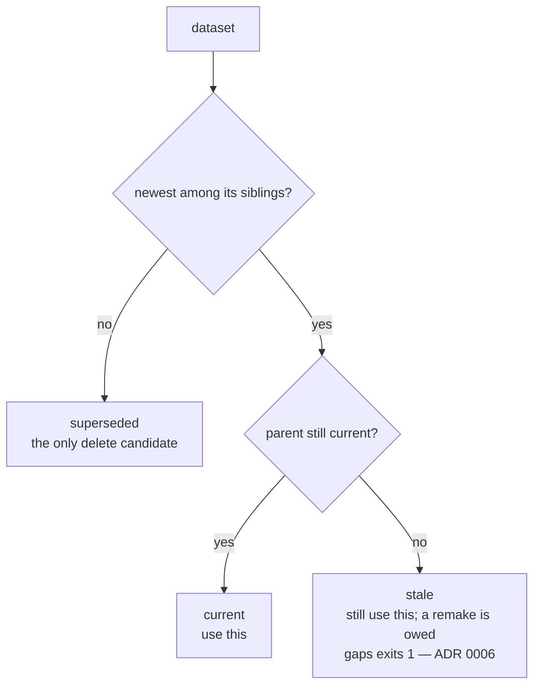

# sim-epochs

The Mu2e simulation-epochs catalog. It answers, from SAM parentage and
on every run: which simulation datasets exist, which one to use, what
each was made with, and what can be retired together. A person supplies
only what a machine cannot know: one small JSON per digitization
campaign with a name, a purpose, a standing and the root patterns.
Nothing derived is ever stored.

Design: `docs/design.md`. Glossary: `CONTEXT.md`. Decisions:
`docs/adr/`. Cut from `Mu2e/prodtools` on 2026-09-05 with its history.

## How it fits together



An epoch is one digitization campaign. Its roots are `dig` patterns;
everything downstream of a root by parentage is a member. Re-reco or
re-ntuple never starts a new epoch; re-digitizing does.



## The status rule

Status is a property of one dataset, computed against its siblings —
same family, tier and description, different dsconf. It answers one
question: should new work use this dataset.



Families (`MDC2025`, `Run1B`, `MDC2020`) never compete with each other.
A **hold** is separate from status: a held dataset can be superseded
for new work and still undeletable.

**The rule (ADR 0006):** the newest-named dataset per description is
the one to run on, and production keeps that promise — a remade parent
obligates remaking every downstream tier before the round is complete.
`bin/epochs gaps` is the round-complete check.

## Running

Any Mu2e node. The only runtime dependency outside the standard library
is `samweb_client`, which is not on PyPI:

```bash
source /cvmfs/mu2e.opensciencegrid.org/setupmu2e-art.sh
muse setup ops
bin/epochs members --family Run1B --status current
```

No Musing, no `muse setup SimJob`, no production account.

## Verbs

| verb | answers |
|---|---|
| `members [--tier T] [--status S]` | which datasets exist and which one to use; tier-major, `status tier epoch nfiles dataset` |
| `gaps` | a dig content with no mcs or nts yet, and every stale member; **exits 1** on a stale member of a current epoch |
| `consistency` | generation spread per tier: which musing and Offline version made the current datasets |
| `lookup DATASET` | one dataset's epoch, status, generation, children, `superseded_by` |
| `retire` | delete candidates in `purge_proposal` line format; refuses while the catalog is incomplete |
| `propose --family F` | write `data/epochs/<letters>.json` for every dig campaign that has none |
| `index-cnfs` | rebuild `data/epochs/cnf_index.json` |
| `publish --out FILE` | the catalog document the sim-epochs MCP server reads |

`--family F` restricts the build for `members`, `gaps`, `lookup` and
`consistency` (seconds instead of minutes); `retire` and `publish`
always build every family. `--epoch` filters printed rows for
`members`, `gaps` and `retire`, and is refused elsewhere. `--json` on
any listing verb. `--quiet` drops the stderr progress.

Generation is read out of the cnf jobdef tarball, so it is evaluated
for MDC2025 and Run1B only: MDC2020-era cnfs are per-job `.fcl` files,
and those rows read `not evaluated`.

## Epoch files

One per digitization campaign:

```json
{
  "name": "Run1Ban",
  "purpose": "SimJob/Run1Ban, Offline v13_17_10",
  "status": "frozen",
  "roots": ["dig.mu2e.%.Run1Ban.art", "dig.mu2e.%.Run1Ban_%.art", "dig.mu2e.%.Run1Ban-%.art"],
  "pins": {"exclude": [], "hold": [], "not_expected": [], "order": [], "notes": []}
}
```

`status` is the epoch's standing: `current` (being worked on),
`frozen` (a hold on every member, nothing expected to change),
`retired` (every member a delete candidate). Pins are the only other
curated input, each with a reason.

## Layout

| module | lines | does |
|---|---:|---|
| `sim_epochs/cli.py` | 456 | the verbs, scoping, exit codes |
| `sim_epochs/graph.py` | 333 | members of every epoch, from SAM parentage |
| `sim_epochs/generation.py` | 260 | what code made a dataset, from the cnf |
| `sim_epochs/reports.py` | 253 | gaps, retire list, lookup, consistency |
| `sim_epochs/status.py` | 201 | current / stale / superseded |
| `sim_epochs/source.py` | 172 | the only module that talks to SAM |
| `sim_epochs/epoch_files.py` | 152 | load, validate, propose epoch files |
| `sim_epochs/mu2e.py` | 126 | the Mu2e conventions: name grammar, cnf tarball, SAM calls, paths |
| `sim_epochs/progress.py` | 109 | stderr progress for a multi-minute build |
| `sim_epochs/publish.py` | 88 | the catalog document |
| `sim_epochs/dsconf.py` | 83 | dsconf grammar and clock-free ordering |

2237 lines of code, 2177 of tests (165, no SAM, no Mu2e environment),
27 epoch files, a 257 KB cnf index.

## Tests

```bash
python3 -m unittest discover -s tests
```

`samweb_client` is stubbed; CI runs the suite on Python 3.9, 3.10 and 3.12.
